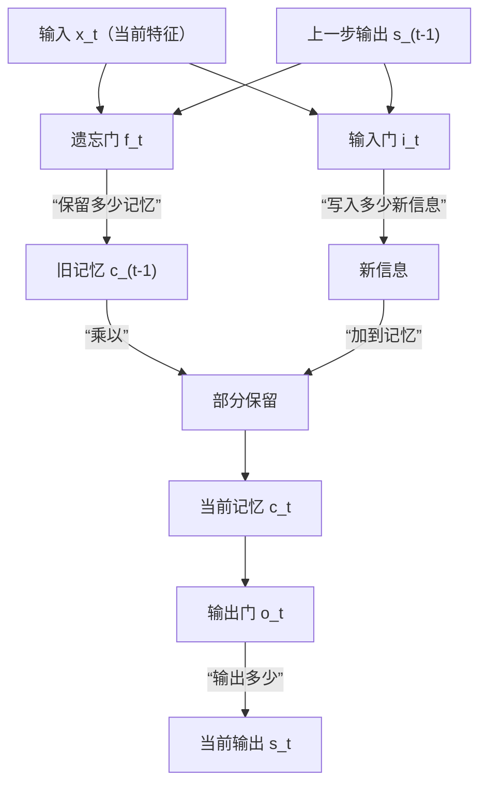

# 项目结构与模块说明

## 一、项目结构规划

```
项目根目录/
│
├── docs/                # 文档目录
│   └── structure.md     # 项目结构与模块说明（本文件）
│
├── recognition/         # 识别模块（瞳孔/虹膜检测与三维坐标提取）
│   └── ...
│
├── fitting/             # 拟合模块（PnP坐标变换与视线向量计算）
│   └── ...
│
├── tracking/            # 追踪模块（LSTM建模与预测）
│   └── ...
│
├── interaction/         # 交互模块（ROI映射与接口）
│   └── ...
│
├── data/                # 数据集与标定文件
│
├── tests/               # 单元测试
│
├── requirements.txt     # 依赖库
└── README.md            # 项目简介
```

---

## 二、各模块详细说明

###  识别模块（recognition）

#### 1. 概念与流程说明

本模块的目标是：
**从摄像头采集的RGB图像和深度图中，自动检测出人脸、瞳孔中心和虹膜边界点，并将这些点的二维归一化坐标转换为相机参考系下的三维坐标。**

##### 主要步骤
1. **采集图像**  
   用RGB-D摄像头获取一帧RGB图像和对应的深度图。

2. **检测人脸关键点**  
   使用MediaPipe等工具，自动检测人脸上的468个人脸关键点（landmark），其中包括瞳孔、虹膜、眼角等。

3. **提取瞳孔中心与虹膜边界点**  
   - MediaPipe中，左眼瞳孔中心的编号是468，右眼是473。
   - 虹膜边界点编号为469到472（左眼），474到477（右眼）。
   - 这些编号对应的点，都是归一化坐标$$(x_{\text{norm}}, y_{\text{norm}})$$，范围在[0,1]。

---

#### 2. 关键公式（含参数解释）

- **归一化坐标转像素坐标**  
  归一化坐标的含义：  
  例如 $(0.5, 0.5)$ 表示图片正中心，$(0, 0)$ 表示左上角，$(1, 1)$ 表示右下角。

  转换公式：  
  $$
  x_{\text{pixel}} = x_{\text{norm}} \times W
  $$
  $$
  y_{\text{pixel}} = y_{\text{norm}} \times H
  $$
  其中 $W$、$H$ 分别为图片的宽和高。

  举例：  
  假设图片宽度 $W=640$，高度 $H=480$，瞳孔中心归一化坐标为 $(x_{\text{norm}}, y_{\text{norm}}) = (0.5, 0.5)$，则
  $$
  x_{\text{pixel}} = 0.5 \times 640 = 320
  $$
  $$
  y_{\text{pixel}} = 0.5 \times 480 = 240
  $$
  即瞳孔中心在图片正中央。

- **像素坐标结合深度，转为相机三维坐标**  
  深度图 $D(x_{\text{pixel}}, y_{\text{pixel}})$ 给出该点的深度 $Z$。

  若已知相机内参 $(f_x, f_y, c_x, c_y)$，则三维坐标为：
  $$
  X = \frac{(x_{\text{pixel}} - c_x) \times Z}{f_x}
  $$
  $$
  Y = \frac{(y_{\text{pixel}} - c_y) \times Z}{f_y}
  $$
  $$
  Z = D(x_{\text{pixel}}, y_{\text{pixel}})
  $$

- **参数说明：**
  - $x_{\text{pixel}}, y_{\text{pixel}}$：像素坐标
  - $x_{\text{norm}}, y_{\text{norm}}$：归一化坐标
  - $W, H$：图片宽度、高度
  - $D(x_{\text{pixel}}, y_{\text{pixel}})$：深度图在该像素点的深度值
  - $f_x, f_y$：相机焦距（像素）
  - $c_x, c_y$：相机主点（像素）
  - $X, Y, Z$：相机三维坐标

---

#### 3. 典型调用流程（分点详细说明）

1. **导入库并初始化模型**
   ```python
   import mediapipe as mp
   mp_face_mesh = mp.solutions.face_mesh.FaceMesh(static_image_mode=False, max_num_faces=1)
   ```

2. **读取一帧RGB图像和深度图**
   ```python
   import cv2
   rgb_image = cv2.imread('test.jpg')
   depth_map = ...  # 读取深度图，格式为二维数组
   ```

3. **检测人脸关键点**
   ```python
   results = mp_face_mesh.process(cv2.cvtColor(rgb_image, cv2.COLOR_BGR2RGB))
   landmarks = results.multi_face_landmarks[0].landmark
   ```

4. **提取瞳孔中心与虹膜边界点**
   ```python
   left_pupil = landmarks[468]  # 左眼瞳孔中心
   right_pupil = landmarks[473] # 右眼瞳孔中心
   # 虹膜边界点
   left_iris = [landmarks[i] for i in range(469, 473)]
   right_iris = [landmarks[i] for i in range(474, 478)]
   ```

5. **归一化坐标转像素坐标**
   ```python
   h, w, _ = rgb_image.shape
   x_pixel = left_pupil.x * w
   y_pixel = left_pupil.y * h
   ```

6. **像素坐标结合深度，转为三维坐标**
   ```python
   Z = depth_map[int(y_pixel), int(x_pixel)]
   # 假设已知相机内参
   fx, fy, cx, cy = ...  # 需标定获得
   X = (x_pixel - cx) * Z / fx
   Y = (y_pixel - cy) * Z / fy
   ```

---

### 2. 拟合模块（fitting）

#### 1. 白话理论导视

视线拟合的本质：
我们通过虹膜边界点拟合出眼球的球心，再用球心和瞳孔中心连线，得到一个“理论视线向量”。
但实际上，人眼的真实注视方向和这个理论向量之间，往往存在一个小的、但稳定的夹角。
这个夹角的原因包括：每个人的眼球结构、瞳孔位置、甚至相机安装方式等，都会导致理论视线和真实视线之间有一个“个体常量”偏差。
我们把这个偏差角称为**Kappa角**。
在实际应用中，只要对每个人做一次标定（让他注视已知点），就能算出这个Kappa角，后续所有视线都可以用它来补偿修正。

---

#### 2. 关键公式（含参数解释）

- **球面拟合（最小二乘法）**  
  $$
  \min_{\mathbf{C}_{\text{eye}}, r} \sum_{i=1}^N \left( \left\| \mathbf{P}_i - \mathbf{C}_{\text{eye}} \right\| - r \right)^2
  $$
  - $\mathbf{P}_i$：第$i$个虹膜边界点的三维坐标
  - $\mathbf{C}_{\text{eye}}$：拟合得到的眼球球心
  - $r$：拟合得到的球半径
  - $N$：虹膜边界点的数量

- **理论视线向量**  
  $$
  \vec{gaze}_{\text{theory}} = \frac{\mathbf{C}_{\text{pupil}} - \mathbf{C}_{\text{eye}}}{\left\| \mathbf{C}_{\text{pupil}} - \mathbf{C}_{\text{eye}} \right\|}
  $$
  - $\mathbf{C}_{\text{pupil}}$：瞳孔中心三维坐标
  - $\mathbf{C}_{\text{eye}}$：眼球球心三维坐标

- **实际视线向量**  
  $$
  \vec{gaze}_{\text{actual}} = \frac{\mathbf{P}_{\text{target}} - \mathbf{C}_{\text{eye}}}{\left\| \mathbf{P}_{\text{target}} - \mathbf{C}_{\text{eye}} \right\|}
  $$
  - $\mathbf{P}_{\text{target}}$：已知注视点的三维坐标

- **Kappa角的计算**  
  $$
  \kappa = \arccos \left( \vec{gaze}_{\text{theory}} \cdot \vec{gaze}_{\text{actual}} \right)
  $$
  - $\cdot$ 表示向量点积

- **补偿后的视线向量**  
  $$
  \vec{gaze}_{\text{final}} = \text{Rotate}(\vec{gaze}_{\text{theory}}, \kappa)
  $$
  - $\kappa$：Kappa角，表示理论视线与实际注视方向的夹角
  - $\text{Rotate}$：表示将理论向量绕合适轴旋转$\kappa$角

---

#### 3. 最小二乘法拟合说明

**定性说明：**  
最小二乘法是一种常用的拟合方法，核心思想是：  
我们有一组点（比如虹膜边界点），希望找到一个“最合适的球”，让这些点尽量都落在球面上。  
“最合适”指的是：所有点到球心的距离和球半径的差的平方之和最小。  
换句话说，最小二乘法就是让所有点“离球面最近”，整体误差最小。  
这种方法不需要你掌握复杂的数学推导，只要理解它是在“让所有点都尽量贴合球面”即可。

**实际应用场景举例：**  
- 在眼动追踪中，我们用最小二乘法拟合虹膜边界点，得到眼球的球心和半径，为后续视线计算提供基础。

---

#### 4. 举例说明

假设：
- 已知4个虹膜边界点三维坐标 $\mathbf{P}_1, \mathbf{P}_2, \mathbf{P}_3, \mathbf{P}_4$
- 瞳孔中心三维坐标 $\mathbf{C}_{\text{pupil}}$
- 注视点三维坐标 $\mathbf{P}_{\text{target}}$

1. 用最小二乘法拟合球面，得到球心 $\mathbf{C}_{\text{eye}}$ 和半径 $r$  
   （见下方Python示例，自动完成拟合）
2. 计算理论视线向量：
   $$
   \vec{gaze}_{\text{theory}} = \frac{\mathbf{C}_{\text{pupil}} - \mathbf{C}_{\text{eye}}}{\left\| \mathbf{C}_{\text{pupil}} - \mathbf{C}_{\text{eye}} \right\|}
   $$
3. 计算实际视线向量：
   $$
   \vec{gaze}_{\text{actual}} = \frac{\mathbf{P}_{\text{target}} - \mathbf{C}_{\text{eye}}}{\left\| \mathbf{P}_{\text{target}} - \mathbf{C}_{\text{eye}} \right\|}
   $$
4. 计算Kappa角并补偿：
   $$
   \kappa = \arccos \left( \vec{gaze}_{\text{theory}} \cdot \vec{gaze}_{\text{actual}} \right)
   $$
   $$
   \vec{gaze}_{\text{final}} = \text{Rotate}(\vec{gaze}_{\text{theory}}, \kappa)
   $$

**最小二乘法计算示例：**  
见下方“球面拟合算法示例”代码，输入点云，自动输出最优球心和半径。

---

#### 5. Python简明示例

球面拟合算法示例
```python
import numpy as np
from scipy.optimize import least_squares

# points: N x 3 的虹膜边界点三维坐标数组
def fit_sphere(points):
    # 残差函数：每个点到球心距离与半径的差
    def residuals(params, xyz):
        cx, cy, cz, r = params
        return np.sqrt((xyz[:,0]-cx)**2 + (xyz[:,1]-cy)**2 + (xyz[:,2]-cz)**2) - r
    # 初始猜测：球心为点云均值，半径为均值到点的距离
    center_init = np.mean(points, axis=0)
    r_init = np.mean(np.linalg.norm(points - center_init, axis=1))
    params_init = np.append(center_init, r_init)
    # 最小二乘拟合
    result = least_squares(residuals, params_init, args=(points,))
    cx, cy, cz, r = result.x
    return np.array([cx, cy, cz]), r

# 示例数据（4个虹膜边界点）
iris_points = np.array([
    [1.0, 0.0, 0.0],
    [0.0, 1.0, 0.0],
    [-1.0, 0.0, 0.0],
    [0.0, -1.0, 0.0]
])
C_eye, r = fit_sphere(iris_points)
print('拟合球心:', C_eye, '拟合半径:', r)
```

Kappa补偿算法示例
```python
import numpy as np

def unit_vector(v):
    return v / np.linalg.norm(v)

# 已知：球心C_eye，瞳孔中心C_pupil，注视点P_target
C_eye = np.array([0, 0, 0])
C_pupil = np.array([0, 0, 1])
P_target = np.array([0.1, 0, 1])

# 理论视线向量
gaze_theory = unit_vector(C_pupil - C_eye)
# 实际视线向量
gaze_actual = unit_vector(P_target - C_eye)

# 计算Kappa角
cos_kappa = np.dot(gaze_theory, gaze_actual)
kappa = np.arccos(np.clip(cos_kappa, -1.0, 1.0))

print(f'Kappa角（弧度）: {kappa:.4f}')

# 补偿后的视线向量（示例：实际应用中应用旋转，这里仅演示计算Kappa）
# 实际补偿时可用scipy.spatial.transform.Rotation等工具
```

---

### 3. 追踪模块（tracking）

#### 1. 白话理论导视

我们的视线运动在大多数情况下，角速度是比较平稳的，也就是说，视线的变化趋势往往可以用“上一时刻”和“当前时刻”来预测“下一时刻”。这在数学上叫做“一阶马尔可夫模型”，即：
$$
P(\text{下一时刻} | \text{当前时刻}, \text{上一时刻}) = P(\text{下一时刻} | \text{当前时刻})
$$

这意味着，只要我们知道上一帧和当前帧的视线信息，就可以较好地估计下一帧的视线。这样做的好处是：
- 不需要很高的采样帧率，降低了硬件成本
- 可以用较少的数据，获得较平滑的追踪效果

LSTM（长短时记忆网络）正好适合这种“用记忆+新输入预测未来”的场景。LSTM会把之前所有时刻的输出作为“记忆”，当前帧作为“输入”，通过一套“选择性遗忘和写入”的机制，自动决定哪些历史信息要保留，哪些要丢弃，从而更好地预测下一帧的视线。

当然，现实中我们有时会发生“快速眼动”（saccade），这时视线角速度会突然变大，短时间内变化剧烈，不再满足马尔可夫模型的平稳假设。为此，LSTM的门控机制（如遗忘门、输入门）会根据事件密度、角速度等特征，自动调整“记忆保留”与“新信息写入”的比例，确保模型在平稳和跳变两种状态下都能做出合理判断。

#### 2. LSTM结构图（简明直观版）



**图解说明：**
- 输入 $x_t$ 和上一步输出 $s_{t-1}$ 共同决定“遗忘门”和“输入门”的开关程度。
- 遗忘门 $f_t$ 决定旧记忆 $c_{t-1}$ 保留多少。
- 输入门 $i_t$ 决定新信息写入多少。
- 两者合成新的记忆 $c_t$。
- 输出门 $o_t$ 决定最终输出 $s_t$。

---

#### 3. 公式详细定性说明

- **遗忘门（Forget Gate）**
  $$
  f_t = \sigma(W_f [s_{t-1}, x_t] + b_f)
  $$
  - 作用：决定“历史记忆”保留多少。$f_t$ 越接近1，越多历史信息被保留；越接近0，越多被遗忘。
  - 通俗理解：像一个“水龙头”，调节记忆流量。

- **输入门（Input Gate）**
  $$
  i_t = \sigma(W_i [s_{t-1}, x_t] + b_i)
  $$
  - 作用：决定“新信息”写入多少。$i_t$ 越大，越多新信息被记住。
  - 通俗理解：像一个“闸门”，决定新知识能进多少。

- **新信息生成**
  $$
  \tilde{c}_t = \tanh(W_c [s_{t-1}, x_t] + b_c)
  $$
  - 作用：生成当前时刻要写入的“新记忆内容”。

- **记忆状态更新**
  $$
  c_t = f_t * c_{t-1} + i_t * \tilde{c}_t
  $$
  - 作用：新记忆 = “部分旧记忆” + “部分新信息”
  - 通俗理解：像记笔记，先擦掉一部分旧的，再写上新的。

- **输出门（Output Gate）**
  $$
  o_t = \sigma(W_o [s_{t-1}, x_t] + b_o)
  $$
  - 作用：决定最终输出多少记忆内容。

- **最终输出**
  $$
  s_t = o_t * \tanh(c_t)
  $$
  - 作用：输出当前预测结果。

- **损失函数（均方误差MSE）**
  $$
  \text{MSE} = \frac{1}{N} \sum_{i=1}^N \left\| \vec{gaze}_{\text{pred}}^{(i)} - \vec{gaze}_{\text{true}}^{(i)} \right\|^2
  $$
  - 作用：衡量预测和真实的差距，越小越好。
  - 通俗理解：像考试分数，分数越低，说明做得越差，模型会自动“改正错误”。

---

#### 4. 示例模型（图片内容通俗解释）

1. **输入特征向量（共9维）**  
   $x_t = (\overrightarrow{g_x}, \overrightarrow{g_y}, \overrightarrow{g_z}, v_\theta, v_\varphi, Conf_{this}, Conf_{that}, EventDensity, \Delta t)$  
   包括上一帧gaze向量、3帧内平均角速度（水平与垂直方向）、双眼图像置信度、事件像素密度（跳变判断指标）、当前帧时间间隔。

2. **遗忘门（Forget Gate）**  
   - 作用：判断是否保留历史gaze记忆。  
   - 公式：$f_t = \sigma(w_1[s_{t-1}, x_t] + b_1)$  
   - 通俗解释：  
     如果事件密度大于0.3或角速度大于500°/s，说明视线发生了剧烈跳变，这时遗忘门$f_t$会让网络“快速遗忘”之前的记忆（$f_t$趋近于0）；如果视线平稳，$f_t$趋近于1，历史信息被保留。

3. **输入门（Input Gate）**  
   - 作用：判断是否允许新状态写入。  
   - 公式：$i_t = \sigma(w_2[s_{t-1}, x_t] + b_2)$  
   - 通俗解释：  
     当图像置信度高时，输入门$i_t$会让新信息写入记忆；置信度低时，$i_t$趋近于0，保持静止，不写入新状态。

4. **状态更新**  
   - 公式：$c_t = f_t c_{t-1} + i_t \tilde{c}_t$  
   - 通俗解释：  
     新的记忆状态$c_t$由两部分组成：一部分是“遗忘门”保留下来的旧记忆，另一部分是“输入门”允许写入的新信息。这样既能记住重要历史，又能及时更新新状态。

5. **输出门（Output Gate）**  
   - 作用：决定当前输出多少信息。  
   - 公式：$o_t = \sigma(w_3[s_{t-1}, x_t] + b_3)$  
   - 通俗解释：  
     当视线处于变动状态（如EventDensity较大）时，输出门$o_t$会增强输出，反映出视线的快速变化；当视线静止或置信度低时，$o_t$会抑制输出，减少噪声影响。

6. **最终输出**  
   - 公式：$y_t = w_4 h_t + b_4$，其中$h_t = o_t * \tanh(c_t)$  
   - 通俗解释：  
     最终输出$y_t$就是当前时刻预测的gaze向量，综合了历史记忆、当前输入和门控机制的调节。

7. **损失函数**  
   - 采用MSE损失函数，衡量预测gaze与真实gaze的差距，训练时自动优化参数。

**总结：**  
LSTM通过“遗忘门”“输入门”“输出门”三道关卡，灵活地保留、更新和输出信息，既能应对视线的平稳变化，也能适应快速跳变。每一步都由神经网络自动学习最优的“开关”方式，最终实现对gaze的精准追踪。

---

### 4. 交互模块（interaction）
#### 流程白话说明
1. 根据追踪结果和深度，计算gaze与屏幕的交点。
2. 以交点为圆心，误差为半径，定义ROI区域。
3. 赋予不同区域优先级，选取最高优先级区域进行交互。
4. 提供API接口，供前端调用，实现点击、聚焦等操作。

#### 关键公式
- 屏幕交点：
  \[
  O = \text{Intersect}(\vec{gaze}, \text{screen\_plane})
  \]
- ROI判定：
  \[
  \text{ROI} = \{P \mid \|P - O\| < r\}
  \]
- 优先级选择：
  \[
  \text{Action} = \arg\max_{region} \text{Priority}(region)
  \]

#### 主要库与函数
- opencv：`cv2.line`, `cv2.pointPolygonTest`
- flask/fastapi：`@app.post('/gaze_action')`

#### 典型调用
```python
from fastapi import FastAPI
app = FastAPI()
@app.post('/gaze_action')
def gaze_action(data: dict):
    # 处理交互
    pass
```

---

## 三、数据与测试
- 推荐数据集：GazeCapture、EYEDIAP
- 标定：相机内参标定（OpenCV `cv2.calibrateCamera`）
- 单元测试建议：每个模块分别编写测试用例，保证接口和流程正确。 