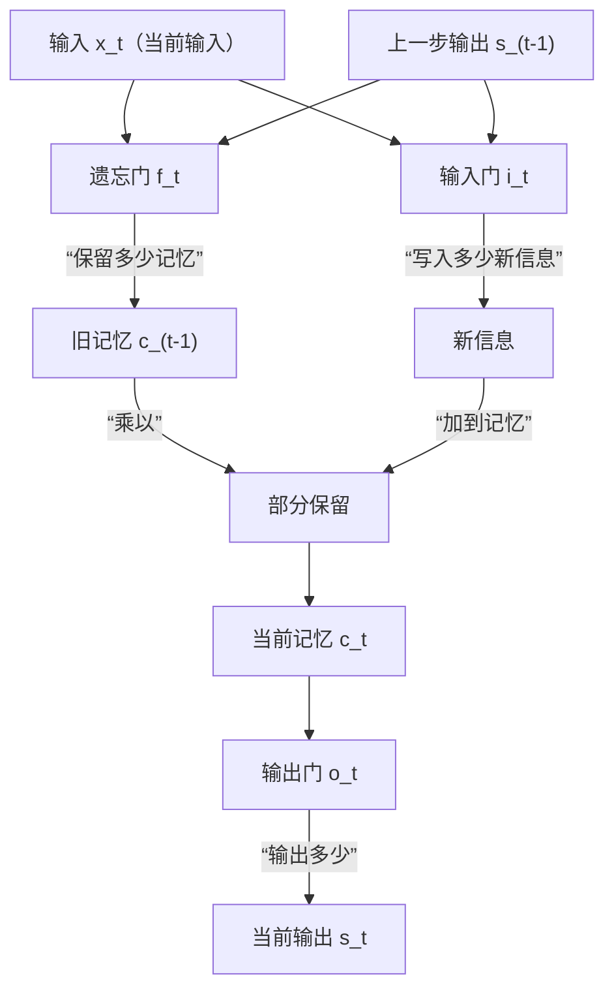
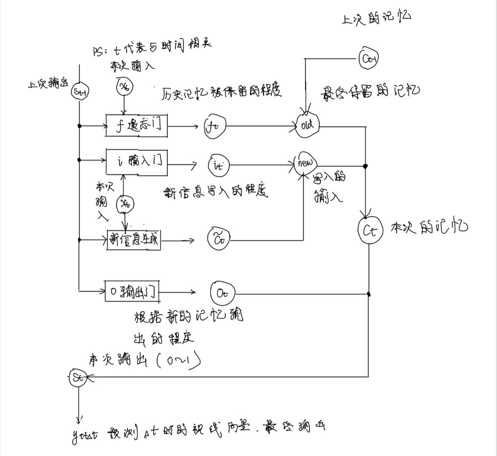

# 项目结构与模块说明

## 一、项目结构规划

```
项目根目录/
│
├── docs/                # 文档目录
│   └── structure.md     # 项目结构与模块说明（本文件）
│
├── recognition/         # 识别模块（瞳孔/虹膜检测与三维坐标提取）
│   └── ...
│
├── fitting/             # 拟合模块（PnP坐标变换与视线向量计算）
│   └── ...
│
├── tracking/            # 追踪模块（LSTM建模与预测）
│   └── ...
│
├── interaction/         # 交互模块（ROI映射与接口）
│   └── ...
│
├── data/                # 数据集与标定文件
│
├── tests/               # 单元测试
│
├── requirements.txt     # 依赖库
└── README.md            # 项目简介
```

---

## 二、各模块详细说明

###  识别模块（recognition）

#### 1. 概念与流程说明

本模块的目标是：
**从摄像头采集的RGB图像和深度图中，自动检测出人脸、瞳孔中心和虹膜边界点，并将这些点的二维归一化坐标转换为相机参考系下的三维坐标。**

##### 主要步骤
1. **采集图像**  
   用RGB-D摄像头获取一帧RGB图像和对应的深度图。

2. **检测人脸关键点**  
   使用MediaPipe等工具，自动检测人脸上的468个人脸关键点（landmark），其中包括瞳孔、虹膜、眼角等。

3. **提取瞳孔中心与虹膜边界点**  
   - MediaPipe中，左眼瞳孔中心的编号是468，右眼是473。
   - 虹膜边界点编号为469到472（左眼），474到477（右眼）。
   - 这些编号对应的点，都是归一化坐标$$(x_{\text{norm}}, y_{\text{norm}})$$，范围在[0,1]。

---

#### 2. 关键公式（含参数解释）

- **归一化坐标转像素坐标**  
  归一化坐标的含义：  
  例如 $(0.5, 0.5)$ 表示图片正中心，$(0, 0)$ 表示左上角，$(1, 1)$ 表示右下角。

  转换公式：  
  $$
  x_{\text{pixel}} = x_{\text{norm}} \times W
  $$
  $$
  y_{\text{pixel}} = y_{\text{norm}} \times H
  $$
  其中 $W$、$H$ 分别为图片的宽和高。

  举例：  
  假设图片宽度 $W=640$，高度 $H=480$，瞳孔中心归一化坐标为 $(x_{\text{norm}}, y_{\text{norm}}) = (0.5, 0.5)$，则
  $$
  x_{\text{pixel}} = 0.5 \times 640 = 320
  $$
  $$
  y_{\text{pixel}} = 0.5 \times 480 = 240
  $$
  即瞳孔中心在图片正中央。

- **像素坐标结合深度，转为相机三维坐标**  
  深度图 $D(x_{\text{pixel}}, y_{\text{pixel}})$ 给出该点的深度 $Z$。

  若已知相机内参 $(f_x, f_y, c_x, c_y)$，则三维坐标为：
  $$
  X = \frac{(x_{\text{pixel}} - c_x) \times Z}{f_x}
  $$
  $$
  Y = \frac{(y_{\text{pixel}} - c_y) \times Z}{f_y}
  $$
  $$
  Z = D(x_{\text{pixel}}, y_{\text{pixel}})
  $$

- **参数说明：**
  - $x_{\text{pixel}}, y_{\text{pixel}}$：像素坐标
  - $x_{\text{norm}}, y_{\text{norm}}$：归一化坐标
  - $W, H$：图片宽度、高度
  - $D(x_{\text{pixel}}, y_{\text{pixel}})$：深度图在该像素点的深度值
  - $f_x, f_y$：相机焦距（像素）
  - $c_x, c_y$：相机主点（像素）
  - $X, Y, Z$：相机三维坐标

---

#### 3. 典型调用流程（分点详细说明）

1. **导入库并初始化模型**
   ```python
   import mediapipe as mp
   mp_face_mesh = mp.solutions.face_mesh.FaceMesh(static_image_mode=False, max_num_faces=1)
   ```

2. **读取一帧RGB图像和深度图**
   ```python
   import cv2
   rgb_image = cv2.imread('test.jpg')
   depth_map = ...  # 读取深度图，格式为二维数组
   ```

3. **检测人脸关键点**
   ```python
   results = mp_face_mesh.process(cv2.cvtColor(rgb_image, cv2.COLOR_BGR2RGB))
   landmarks = results.multi_face_landmarks[0].landmark
   ```

4. **提取瞳孔中心与虹膜边界点**
   ```python
   left_pupil = landmarks[468]  # 左眼瞳孔中心
   right_pupil = landmarks[473] # 右眼瞳孔中心
   # 虹膜边界点
   left_iris = [landmarks[i] for i in range(469, 473)]
   right_iris = [landmarks[i] for i in range(474, 478)]
   ```

5. **归一化坐标转像素坐标**
   ```python
   h, w, _ = rgb_image.shape
   x_pixel = left_pupil.x * w
   y_pixel = left_pupil.y * h
   ```

6. **像素坐标结合深度，转为三维坐标**
   ```python
   Z = depth_map[int(y_pixel), int(x_pixel)]
   # 假设已知相机内参
   fx, fy, cx, cy = ...  # 需标定获得
   X = (x_pixel - cx) * Z / fx
   Y = (y_pixel - cy) * Z / fy
   ```

---

### 2. 拟合模块（fitting）

#### 1. 白话理论导视

视线拟合的本质：
我们通过虹膜边界点拟合出眼球的球心，再用球心和瞳孔中心连线，得到一个“理论视线向量”。
但实际上，人眼的真实注视方向和这个理论向量之间，往往存在一个小的、但稳定的夹角。
这个夹角的原因包括：每个人的眼球结构、瞳孔位置、甚至相机安装方式等，都会导致理论视线和真实视线之间有一个“个体常量”偏差。
我们把这个偏差角称为**Kappa角**。
在实际应用中，只要对每个人做一次标定（让他注视已知点），就能算出这个Kappa角，后续所有视线都可以用它来补偿修正。

---

#### 2. 关键公式（含参数解释）

- **球面拟合（最小二乘法）**  
  $$
  \min_{\mathbf{C}_{\text{eye}}, r} \sum_{i=1}^N \left( \left\| \mathbf{P}_i - \mathbf{C}_{\text{eye}} \right\| - r \right)^2
  $$
  - $\mathbf{P}_i$：第$i$个虹膜边界点的三维坐标
  - $\mathbf{C}_{\text{eye}}$：拟合得到的眼球球心
  - $r$：拟合得到的球半径
  - $N$：虹膜边界点的数量

- **理论视线向量**  
  $$
  \vec{gaze}_{\text{theory}} = \frac{\mathbf{C}_{\text{pupil}} - \mathbf{C}_{\text{eye}}}{\left\| \mathbf{C}_{\text{pupil}} - \mathbf{C}_{\text{eye}} \right\|}
  $$
  - $\mathbf{C}_{\text{pupil}}$：瞳孔中心三维坐标
  - $\mathbf{C}_{\text{eye}}$：眼球球心三维坐标

- **实际视线向量**  
  $$
  \vec{gaze}_{\text{actual}} = \frac{\mathbf{P}_{\text{target}} - \mathbf{C}_{\text{eye}}}{\left\| \mathbf{P}_{\text{target}} - \mathbf{C}_{\text{eye}} \right\|}
  $$
  - $\mathbf{P}_{\text{target}}$：已知注视点的三维坐标

- **Kappa角的计算**  
  $$
  \kappa = \arccos \left( \vec{gaze}_{\text{theory}} \cdot \vec{gaze}_{\text{actual}} \right)
  $$
  - $\cdot$ 表示向量点积

- **补偿后的视线向量**  
  $$
  \vec{gaze}_{\text{final}} = \text{Rotate}(\vec{gaze}_{\text{theory}}, \kappa)
  $$
  - $\kappa$：Kappa角，表示理论视线与实际注视方向的夹角
  - $\text{Rotate}$：表示将理论向量绕合适轴旋转$\kappa$角

---

#### 3. 最小二乘法拟合说明

**定性说明：**  
最小二乘法是一种常用的拟合方法，核心思想是：  
我们有一组点（比如虹膜边界点），希望找到一个“最合适的球”，让这些点尽量都落在球面上。  
“最合适”指的是：所有点到球心的距离和球半径的差的平方之和最小。  
换句话说，最小二乘法就是让所有点“离球面最近”，整体误差最小。  
这种方法不需要你掌握复杂的数学推导，只要理解它是在“让所有点都尽量贴合球面”即可。

**实际应用场景举例：**  
- 在眼动追踪中，我们用最小二乘法拟合虹膜边界点，得到眼球的球心和半径，为后续视线计算提供基础。

---

#### 4. 举例说明

假设：
- 已知4个虹膜边界点三维坐标 $\mathbf{P}_1, \mathbf{P}_2, \mathbf{P}_3, \mathbf{P}_4$
- 瞳孔中心三维坐标 $\mathbf{C}_{\text{pupil}}$
- 注视点三维坐标 $\mathbf{P}_{\text{target}}$

1. 用最小二乘法拟合球面，得到球心 $\mathbf{C}_{\text{eye}}$ 和半径 $r$  
   （见下方Python示例，自动完成拟合）
2. 计算理论视线向量：
   $$
   \vec{gaze}_{\text{theory}} = \frac{\mathbf{C}_{\text{pupil}} - \mathbf{C}_{\text{eye}}}{\left\| \mathbf{C}_{\text{pupil}} - \mathbf{C}_{\text{eye}} \right\|}
   $$
3. 计算实际视线向量：
   $$
   \vec{gaze}_{\text{actual}} = \frac{\mathbf{P}_{\text{target}} - \mathbf{C}_{\text{eye}}}{\left\| \mathbf{P}_{\text{target}} - \mathbf{C}_{\text{eye}} \right\|}
   $$
4. 计算Kappa角并补偿：
   $$
   \kappa = \arccos \left( \vec{gaze}_{\text{theory}} \cdot \vec{gaze}_{\text{actual}} \right)
   $$
   $$
   \vec{gaze}_{\text{final}} = \text{Rotate}(\vec{gaze}_{\text{theory}}, \kappa)
   $$

**最小二乘法计算示例：**  
见下方“球面拟合算法示例”代码，输入点云，自动输出最优球心和半径。

---

#### 5. Python简明示例

球面拟合算法示例
```python
import numpy as np
from scipy.optimize import least_squares

# points: N x 3 的虹膜边界点三维坐标数组
def fit_sphere(points):
    # 残差函数：每个点到球心距离与半径的差
    def residuals(params, xyz):
        cx, cy, cz, r = params
        return np.sqrt((xyz[:,0]-cx)**2 + (xyz[:,1]-cy)**2 + (xyz[:,2]-cz)**2) - r
    # 初始猜测：球心为点云均值，半径为均值到点的距离
    center_init = np.mean(points, axis=0)
    r_init = np.mean(np.linalg.norm(points - center_init, axis=1))
    params_init = np.append(center_init, r_init)
    # 最小二乘拟合
    result = least_squares(residuals, params_init, args=(points,))
    cx, cy, cz, r = result.x
    return np.array([cx, cy, cz]), r

# 示例数据（4个虹膜边界点）
iris_points = np.array([
    [1.0, 0.0, 0.0],
    [0.0, 1.0, 0.0],
    [-1.0, 0.0, 0.0],
    [0.0, -1.0, 0.0]
])
C_eye, r = fit_sphere(iris_points)
print('拟合球心:', C_eye, '拟合半径:', r)
```

Kappa补偿算法示例
```python
import numpy as np

def unit_vector(v):
    return v / np.linalg.norm(v)

# 已知：球心C_eye，瞳孔中心C_pupil，注视点P_target
C_eye = np.array([0, 0, 0])
C_pupil = np.array([0, 0, 1])
P_target = np.array([0.1, 0, 1])

# 理论视线向量
gaze_theory = unit_vector(C_pupil - C_eye)
# 实际视线向量
gaze_actual = unit_vector(P_target - C_eye)

# 计算Kappa角
cos_kappa = np.dot(gaze_theory, gaze_actual)
kappa = np.arccos(np.clip(cos_kappa, -1.0, 1.0))

print(f'Kappa角（弧度）: {kappa:.4f}')

# 补偿后的视线向量（示例：实际应用中应用旋转，这里仅演示计算Kappa）
# 实际补偿时可用scipy.spatial.transform.Rotation等工具
```

---

### 3. 追踪模块（tracking）

#### 1. 白话理论导视
如果我们采用每时每刻都通过相机传输的帧来进行视线拟合的算法，那么对相机的性能要求极高，成本大大增加。
因此，我们采取每$\Delta t$估计一次视线的算法。
假设相机的频率是$f$，那么相邻两帧的时间差就是 $t = \frac{1}{f}$。
在这段时间内，我们获得了 $n = \left\lfloor \frac{t}{\Delta t} \right\rfloor$ 个视线向量，其中 $n-1$ 个是拟合的结果。
很明显，假如 $\Delta t$ 是准确拟合视线向量的最大时间间隔（再大就会因为无法捕捉到快速眼动等各种原因变得不准确）
那么我们对相机的性能要求降低了将近 $n$ 倍。
这样就能大大降低成本。

PS：上述的 $\Delta t$ 需要更精确的定量定义。
PS：之后所有的 $t+1$（下一时刻）与$t+\Delta t$（$\Delta t$时间后）、$t-1$（上一时刻）与$t-\Delta t$（$\Delta t$时间前）等价

所以，我们采用预测视线向量的方法。
事实上，我们的视线运动在大多数情况下，角速度是比较平稳的，也就是说，视线的变化趋势往往可以用“上一时刻”和“当前时刻”来预测“下一时刻”。这在数学上叫做“一阶马尔可夫模型”，即：
$$
\theta_t = v_\theta\Delta t + \theta_{t-1}
$$

PS：之所以v带了θ下标，是因为 v 是根据之前的角度预测出来的，比如说，可以根据t-2时刻和t-1时刻的角度计算v。

其中 $\theta_t$ 表示当前时刻的角度，$v_\theta$ 表示角速度，$\theta_{t-1}$ 为上一时刻的角度，$\Delta t$ 是两时刻的间隔。该公式满足一阶马尔可夫模型的假设：当前状态只依赖于前一状态。平视角速度（水平角速度）与俯仰角速度（垂直角速度）都满足上述条件，即只需上一帧和当前帧的信息即可较好地估计下一时刻的视线。

LSTM（长短时记忆网络）正好适合这种“用记忆+新输入预测未来”的场景。LSTM会把之前所有时刻的输出作为“记忆”，当前帧作为“输入”，通过一套“选择性遗忘和写入”的机制，自动决定哪些历史信息要保留，哪些要丢弃，从而更好地预测下一帧的视线。

在这里，我们的“记忆”可以类比为之前所有的视线向量，通过“记忆”能够推测出恒定角速度v（比如说计算平均速度等）。
这样就有了我们的“输出”。
但是，实际情况可能会更复杂，所以需要引入LSTM解决这个问题。

当然，现实中我们有时会发生“快速眼动”（saccade），这时视线角速度会突然变大，短时间内变化剧烈，不再满足马尔可夫模型的平稳假设。为此，LSTM的门控机制（如遗忘门、输入门）会根据事件密度、角速度等特征，自动调整“记忆保留”与“新信息写入”的比例，确保模型在平稳和跳变两种状态下都能做出合理判断。

综上所述，LSTM可以被视为一个“黑箱”模型，其书输入与输出满足如下关系：
$$
\text{LSTM}(x_t) = y_{t+1}
$$
其中：
- $x_t$：输入特征，包含但不限于当前的视线向量（还可以包括历史视线、角速度、置信度等多种特征）。
- $y_{t+1}$：预测在固定时间间隔$\Delta t$之后（下一时刻）的视线向量。

下一步，值得注意的是，黑箱LSTM内部的门控（可以先理解为子黑箱或者子函数）输入输出通常都被归一化到(0,1)区间。这样可以将门控的作用理解为“比例”。这个比例代表了信息的接收程度，便于网络自动学习信息的保留、遗忘和写入程度，同时也有助于模型的数值稳定性和训练收敛速度。 

LSTM（长短时记忆网络，Long Short-Term Memory）是一种特殊的循环神经网络（RNN），能够捕捉序列数据中的长期依赖关系。

马尔可夫模型是一种假设“当前状态只依赖于前一状态”的统计模型，常用于描述序列数据的动态变化。

事件岛模型是一种基于像素变化检测事件的模型，用于识别图像中显著变化区域。

LSTM通过遗忘门、输入门、输出门等门控机制，实现对信息的选择性记忆和遗忘。

#### 2. LSTM结构图（简明直观版）



**图解说明：**
- 输入 $x_t$ 和上一步输出 $s_{t-1}$ 共同决定“遗忘门”和“输入门”的开关程度。
- 遗忘门 $f_t$ 决定旧记忆 $c_{t-1}$ 保留多少。
- 输入门 $i_t$ 决定新信息写入多少。
- 两者合成新的记忆 $c_t$。
- 输出门 $o_t$ 决定最终输出 $s_t$。

---


#### 3. 公式详细定量说明

LSTM的核心由三个门控（遗忘门、输入门、输出门）和单元状态组成，其定量公式如下：

#### 前置说明：

1. W 和 b 是什么？
**W（权重矩阵）是什么？通俗理解是什么？**  
   - **数学定义**：W 是“权重矩阵”，比如 $W_f, W_i, W_c, W_o$ 分别对应遗忘门、输入门、新信息生成、输出门的权重。
   - **通俗理解**：W 就像“筛子”或“调音台旋钮”，决定每个输入和历史信息对门控结果的影响有多大。比如，某些输入特征很重要，W 会把它们“放大”；不重要的特征，W 会“减弱”甚至“屏蔽”。
   - **作用**：W 决定了模型如何“理解”输入和记忆，影响信息流动的“方向”和“强度”。

**b（偏置）是什么？通俗理解是什么？**  
   - **数学定义**：b 是“偏置向量”，比如 $b_f, b_i, b_c, b_o$。
   - **通俗理解**：b 就像“门槛”或“起跑线”，决定门控在没有输入时的“默认状态”。比如，b 可以让门默认更容易“打开”或“关闭”。
   - **作用**：b 帮助模型适应不同的数据分布，让门控机制更灵活。

2. 函数说明
**参数与函数说明：**
- $\sigma(x)$：Sigmoid激活函数，$\sigma(x) = \frac{1}{1 + e^{-x}}$，输出范围(0,1)
- $\tanh(x)$：双曲正切激活函数，$\tanh(x) = \frac{e^x - e^{-x}}{e^x + e^{-x}}$，输出范围(-1,1)
- $W$：权重矩阵，$b$：偏置向量
- $[s_{t-1}, x_t]$：表示将$s_{t-1}$和$x_t$拼接为一个长向量
- $\odot$：逐元素乘法
---


- **遗忘门（Forget Gate）**
  $$
  f_t = \sigma(W_f [s_{t-1}, x_t] + b_f)
  $$
  - $f_t$：遗忘门输出，控制上一步记忆保留多少，取值范围(0,1)
  - $W_f$：遗忘门权重矩阵
  - $b_f$：遗忘门偏置
  - $s_{t-1}$：上一步的输出（隐藏状态）
  - $x_t$：当前输入
  - $[s_{t-1}, x_t]$：表示拼接向量

- **输入门（Input Gate）**
  $$ 
  i_t = \sigma(W_i [s_{t-1}, x_t] + b_i)
  $$
  - $i_t$：输入门输出，控制新信息写入多少，取值范围(0,1)
  - $W_i$：输入门权重矩阵
  - $b_i$：输入门偏置

- **新候选记忆（候选状态）**
  $$
  \tilde{c}_t = \tanh(W_c [s_{t-1}, x_t] + b_c)
  $$
  - $\tilde{c}_t$：当前时刻新生成的候选记忆
  - $W_c$：候选记忆权重矩阵
  - $b_c$：候选记忆偏置

- **单元状态更新**
  $$
  c_t = f_t \odot c_{t-1} + i_t \odot \tilde{c}_t
  $$
  - $c_t$：当前单元状态
  - $c_{t-1}$：上一步单元状态
  - $\odot$：逐元素乘法

- **输出门（Output Gate）**
  $$
  o_t = \sigma(W_o [s_{t-1}, x_t] + b_o)
  $$
  - $o_t$：输出门输出，控制当前状态输出多少，取值范围(0,1)
  - $W_o$：输出门权重矩阵
  - $b_o$：输出门偏置


- **最终输出（隐藏状态）**
  $$
  s_t = o_t \odot \tanh(c_t)
  $$
  - $s_t$：当前输出（隐藏状态）


#### 训练大模型的本质

- **本质**：训练 LSTM（或其他神经网络）模型的过程，就是不断调整 W（权重）和 b（偏置）这两组参数，让模型的预测结果越来越接近真实值。
- **目标**：让模型学会“如何组合输入和记忆”，最终在新数据上也能做出准确预测。

PS： 从这里可以看出，W（权重）和 b（偏置）的初始值，很重要。

---

#### 如何训练大模型

训练大模型的过程可以分为以下几个关键步骤，下面将结合定性讲解和每步的Python代码示例，帮助初学者理解：

1. **损失函数的引入与意义**

在训练大模型时，我们需要一种“数学且计算机能处理”的方法，来判断当前模型参数（如权重W和偏置b）是否合适。这种方法就是**损失函数**。

- 损失函数的本质：
  损失函数用计算出的“分数”来衡量模型输出与真实结果之间的差距。计算机自动计算的“分数”，分数越低，与真是结果的相差越小，说明模型越好。
- 为什么用统计学？
  统计学方法可以帮助我们用一组数据来“预测”模型的整体表现，而不是只看单个样本。
- 如何预测损失？
  比如，**均方误差（MSE）**就是常用的损失函数。它会把每个样本的预测误差平方后求平均，误差越大，损失越大。我们希望通过不断调整参数，让损失函数的值越来越小。
- 数学思想：
  损失函数的“最小值”对应着模型最优的参数。训练的目标，就是找到让损失函数最小的那组参数。

---

2. **训练的基本流程（细化步骤+每步代码）**

（1）**准备数据**  
收集并整理好输入特征（如gaze向量、角速度、置信度等）和对应的真实标签（如真实gaze）。通常需要将数据分为训练集和测试集。

```python
# 假设已用numpy/pandas加载好数据
import torch
from torch.utils.data import DataLoader, TensorDataset

X = ...  # 输入特征，形状如 [样本数, 时间步, 特征数]
y = ...  # 真实标签，形如 [样本数, 输出维度]
dataset = TensorDataset(torch.tensor(X, dtype=torch.float32), torch.tensor(y, dtype=torch.float32))
dataloader = DataLoader(dataset, batch_size=32, shuffle=True)
```

---

（2）**模型初始化**  
随机初始化模型参数（权重W和偏置b）。深度学习框架会自动完成这一步。

```python
import torch.nn as nn

class MyLSTMModel(nn.Module):
    def __init__(self):
        super().__init__()
        self.lstm = nn.LSTM(input_size=9, hidden_size=64, num_layers=2, batch_first=True)
        self.fc = nn.Linear(64, 3)  # 输出gaze向量

    def forward(self, x):
        out, _ = self.lstm(x)
        out = self.fc(out[:, -1, :])  # 取最后一个时刻的输出
        return out

model = MyLSTMModel()
```

---

（3）**前向传播**  
用当前参数计算模型输出（预测值）。这一步就是“让模型做一次预测”。

```python
for batch_x, batch_y in dataloader:
    pred = model(batch_x)  # 前向传播，得到预测值
    break  # 这里只演示一次
```

---

（4）**计算损失**  
用损失函数衡量预测值和真实值的差距。常用MSE损失。

```python
criterion = nn.MSELoss()
loss = criterion(pred, batch_y)
print('当前损失:', loss.item())
```

---

（5）**反向传播**  
根据损失，自动计算每个参数应该如何调整（这一步叫“梯度下降”）。框架会自动完成梯度计算。

```python
loss.backward()  # 自动计算每个参数的梯度
```

---

（6）**参数更新**  
调整参数，让模型预测更接近真实值。通常用优化器（如Adam、SGD）自动完成。

```python
optimizer = torch.optim.Adam(model.parameters(), lr=0.001)
optimizer.step()  # 用计算好的梯度更新参数
optimizer.zero_grad()  # 梯度清零，为下次迭代做准备
```

---

（7）**重复训练**  
不断重复上述过程，直到损失足够小或达到设定的训练轮数。

```python
for epoch in range(epochs):
    for batch_x, batch_y in dataloader:
        pred = model(batch_x)
        loss = criterion(pred, batch_y)
        optimizer.zero_grad()
        loss.backward()
        optimizer.step()
    print(f'Epoch {epoch+1}, Loss: {loss.item()}')
```

---

**总结**：  
整个训练过程就是：
“准备数据 → 随机初始化模型 → 预测 → 计算损失 → 反向传播 → 参数更新 → 重复训练”，
直到模型学会用最小的损失去拟合数据。

#### 4. 示例模型
理论导视：
  （1）如何判断是否发生了快速眼动或者其它原因导致瞳孔位置出现非线性变化？（此时不能再使用原本的马尔克夫模型）
  （2）如何处理一阶马尔克夫模型的LSTM迁移？（怎样用LSTM的形式去量化一阶马尔可夫模型）

回答：
  （1）事件岛模型
   事件：当某一个像素点亮度变化超过阈值的时候，我们认为这个像素点发生了事件。
   当图像中眼睛区域中一定比例的像素发生事件的时候，我们认为此时发生了快速眼动或者其它原因导致视线偏移不再遵循马尔可夫模型。
   此时应该清空之前的所有记忆（或者说遗忘门的输出较小，保留的记忆较少）

  （2）**如何用LSTM的形式去量化一阶马尔可夫模型？**
  
  在一阶马尔可夫模型中，当前状态只依赖于上一时刻的状态。例如，视线的角度$\theta_t$可以用上一时刻的角度$\theta_{t-1}$和角速度$v_\theta$来预测：
  $$
  \theta_t = \theta_{t-1} + v_\theta \Delta t
  $$
  
  在LSTM中，可以通过如下“量化”方式，将马尔可夫思想融入模型：
  
  1. **将上一时刻的角度作为偏置**
     - 做法：在LSTM的某个门控（如输入门或候选门）中，将偏置$b$初始化为上一时刻的角度$\theta_{t-1}$。这样，模型在没有新输入时，默认输出就是“延续”上一时刻的角度，符合马尔可夫假设。
     - 伪代码：
       ```python
       # 设theta_prev为上一时刻的角度
       b_i = theta_prev  # 输入门偏置初始化为上一时刻角度
       ```
  
  2. **将马尔可夫预测项作为输入特征**
     - 做法：把$\theta_{t-1} + v_\theta \Delta t$作为LSTM的一个输入特征，模型可以自动学习“修正”这一预测值。
     - 伪代码：
       ```python
       x_t = [theta_prev, v_theta, theta_prev + v_theta * delta_t, ...]
       # 其中theta_prev + v_theta * delta_t就是马尔可夫预测项
       ```
  
  3. **门控权重的初始化与马尔可夫模型相关**
     - 做法：将与“记忆传递”相关的权重（如遗忘门$w_f$）初始化为较大值，使得LSTM在初期更倾向于保留历史状态，模拟马尔可夫模型的“惯性”。
     - 伪代码：
       ```python
       w_f = 1.0  # 遗忘门权重初始化为较大值，强调历史记忆
       ```
  
  4. **候选记忆的偏置与马尔可夫项相关**
     - 做法：将候选记忆的偏置$b_c$初始化为马尔可夫预测值$\theta_{t-1} + v_\theta \Delta t$，让LSTM在没有新输入时，默认输出为马尔可夫预测。
     - 伪代码：
       ```python
       b_c = theta_prev + v_theta * delta_t
       ```
  
  **意义说明：**
  通过上述“量化”方式，可以让LSTM在初始阶段更好地模拟一阶马尔可夫模型的行为，既保留了传统模型的可解释性，又利用了深度学习的强大拟合能力。实际应用中，可以根据数据和任务需求，灵活选择和组合这些量化方法。
  
  ——

除了上述量化方法，实际输入特征设计也十分关键，下面给出典型输入特征举例：

1. **典型输入特征向量设计（未引入马尔可夫预测项）**  
   $x_t = (\overrightarrow{g_x}, \overrightarrow{g_y}, \overrightarrow{g_z}, v_\theta, v_\varphi, Conf_{this}, Conf_{that}, EventDensity, \Delta t)$  
   - $\overrightarrow{g_x}, \overrightarrow{g_y}, \overrightarrow{g_z}$：上一时刻的gaze向量（视线方向的三维分量）
   - $v_\theta, v_\varphi$：角速度（分别为水平和垂直方向的视线变化速度）
   - $Conf_{this}, Conf_{that}$：双眼图像置信度（反映瞳孔或虹膜区域识别的可靠性）
   - $EventDensity$：事件像素密度（用于检测快速眼动等突变）
   - $\Delta t$：拟合时间差（两时刻之间的时间间隔）

2. **遗忘门（Forget Gate）**  
   - 作用：判断是否保留历史gaze记忆。  
   - 公式：$f_t = \sigma(w_f[s_{t-1}, x_t] + b_f)$  
   - 通俗解释：  
     如果事件密度大于0.3（某个定值）或角速度大于500°/s（某个定值），说明视线发生了剧烈跳变，这时遗忘门$f_t$会让网络“快速遗忘”之前的记忆（$f_t$趋近于0）；如果视线平稳，$f_t$趋近于1，历史信息被保留。

3. **输入门（Input Gate）**  
   - 作用：判断是否允许新状态写入。  
   - 公式：$i_t = \sigma(w_i[s_{t-1}, x_t] + b_i)$  
   - 通俗解释：  
     当图像置信度高时，输入门$i_t$会让新信息写入记忆；置信度低时，$i_t$趋近于0，保持静止，不写入新状态。

4. **状态更新**  
   - 公式：$c_t = f_t c_{t-1} + i_t \tilde{c}_t$  
   - 通俗解释：  
     新的记忆状态$c_t$由两部分组成：一部分是“遗忘门”保留下来的旧记忆，另一部分是“输入门”允许写入的新信息。这样既能记住重要历史，又能及时更新新状态。

5. **输出门（Output Gate）**  
   - 作用：决定当前输出多少信息。  
   - 公式：$o_t = \sigma(w_o[s_{t-1}, x_t] + b_o)$  
   - 通俗解释：  
     当视线处于变动状态（如EventDensity较大）时，输出门$o_t$会增强输出，反映出视线的快速变化；当视线静止或置信度低时，$o_t$会抑制输出，减少噪声影响。

6. **最终输出**  
   - 公式：$y_t = w_y s_t + b_y$，其中$s_t = o_t * \tanh(c_t)$  
   - 通俗解释：  
     最终输出$y_t$就是当前时刻预测的gaze向量，综合了历史记忆、当前输入和门控机制的调节。

7. **损失函数**  
   - 采用MSE损失函数，衡量预测gaze与真实gaze的差距，训练时自动优化参数。

**总结：**  
LSTM通过“遗忘门”“输入门”“输出门”三道关卡，灵活地保留、更新和输出信息，既能应对视线的平稳变化，也能适应快速跳变。每一步都由神经网络自动学习最优的“开关”方式，最终实现对gaze的精准追踪。

**后续工作建议：**  
量化上述过程并且进行场景计算评估。

---

### 4. 交互模块（interaction）
#### 流程白话说明
1. 根据追踪结果和深度，计算gaze与屏幕的交点。
2. 以交点为圆心，误差为半径，定义ROI（感兴趣的区域）区域。
3. 赋予不同区域优先级，选取最高优先级区域进行交互
例如屏幕中无交互区域的优先级为0；按钮、链接等交互区域的优先级为1；常用的交互区域优先级为2；双眼ROI交集优先级加法计算等。
4. 提供API接口，供前端调用，实现点击、聚焦等操作。

#### 关键公式
- 屏幕交点：
  \[
  O = \text{Intersect}(\vec{gaze}, \text{screen\_plane})
  \]
- ROI判定：
  \[
  \text{ROI} = \{P \mid \|P - O\| < r\}
  \]
- 优先级选择：
  \[
  \text{Action} = \arg\max_{region} \text{Priority}(region)
  \]

#### 主要库与函数
- opencv：`cv2.line`, `cv2.pointPolygonTest`
- flask/fastapi：`@app.post('/gaze_action')`

#### 典型调用
```python
from fastapi import FastAPI
app = FastAPI()
@app.post('/gaze_action')
def gaze_action(data: dict):
    # 处理交互
    pass
```

---

## 三、数据与测试
- 推荐数据集：GazeCapture、EYEDIAP
- 标定：相机内参标定（OpenCV `cv2.calibrateCamera`）
- 单元测试建议：每个模块分别编写测试用例，保证接口和流程正确。 

